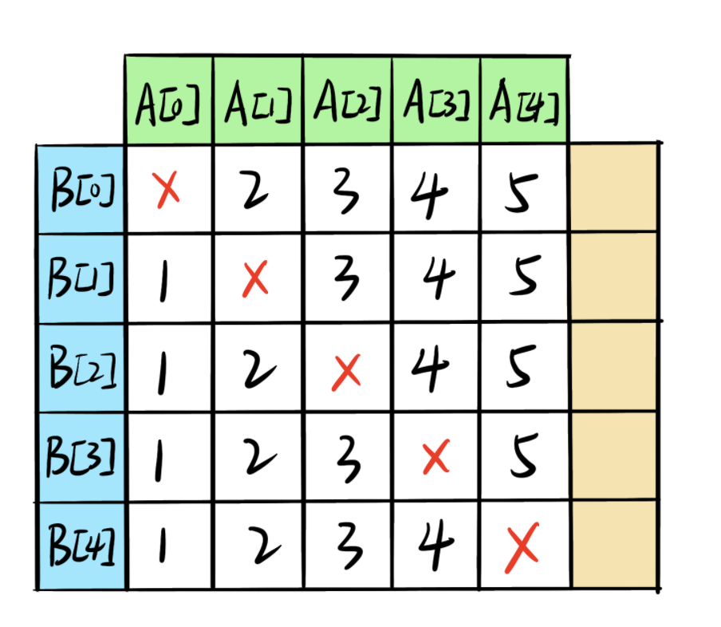

# 构建乘积数组

## 剑指 Offer 66. 构建乘积数组

### 题目

```text
给定一个数组 A[0,1,…,n-1]，请构建一个数组 B[0,1,…,n-1]，其中 B[i] 的值是数组 A 中除了下标 i 以外的元素的积, 即 B[i]=A[0]×A[1]×…×A[i-1]×A[i+1]×…×A[n-1]。不能使用除法。


示例:

输入: [1,2,3,4,5]
输出: [120,60,40,30,24]


提示：

所有元素乘积之和不会溢出 32 位整数
a.length <= 100000
```

### 题解

#### 数组遍历



```javascript
/**
 * @param {number[]} a
 * @return {number[]}
 */
var constructArr = function(a) {
    const res = [];

    // 遍历左下角三角
    let left = 1;
    for(let i=0;i<a.length;i++){
        res[i] = left;
        left *= a[i];
    }
    // 遍历右上角三角
    let right = 1;
    for(let j=a.length-1;j>=0;j--){
        res[j] = res[j]*right;
        right *= a[j];
    }
    return res;
};
```

